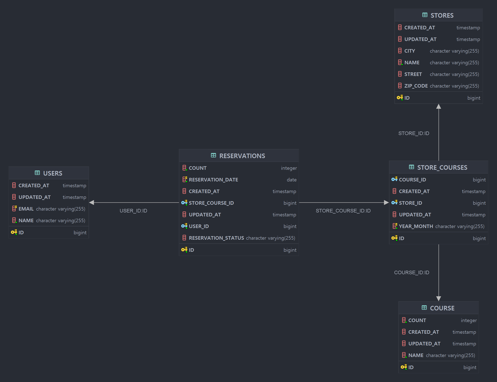
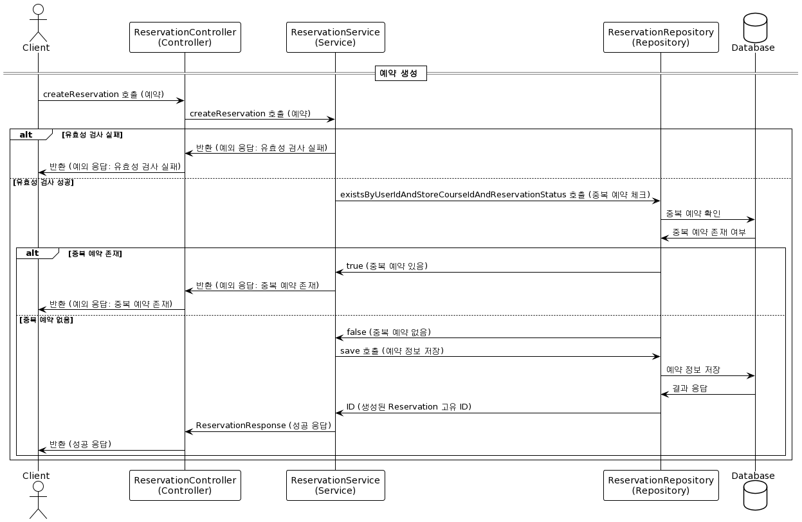
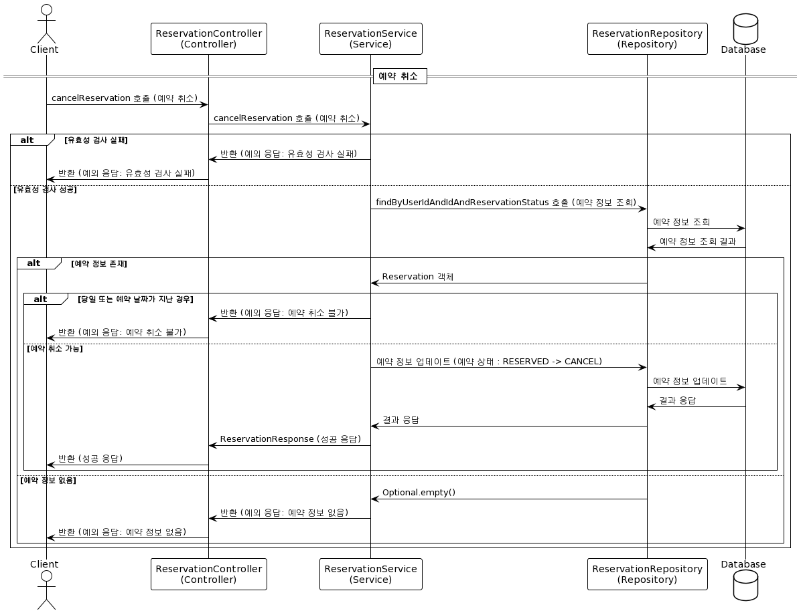
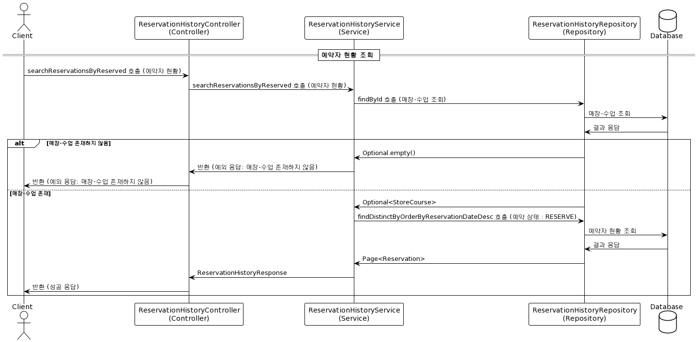
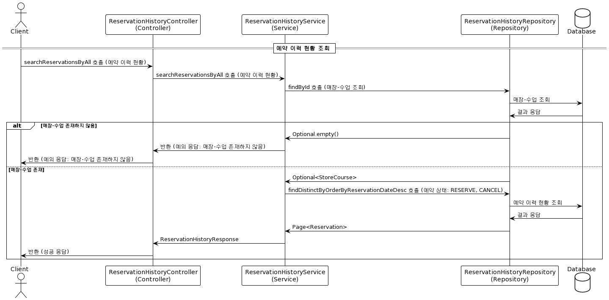

# 째깍섬 예약 API

<br/>

## API 요구사항

### [ 부모 ]
- 모델 : 이름, 이메일
### [ 매장 ]
- 모델 : 이름, 주소
- 잠실점, 일산점, 판교점
### [ 수업 ]
- 모델 : 이름, 하루 최대 인원수
- 도시농부, 드로잉, 오감 놀이
- 매장 별 하루에 한번만 진행
- 매장별 유지 및 변경 가능
- 최대 20명 -> 최대 인원수 변경 가능
### [ 예약 ]
- 한 가구에서 여러 명의 아이 예약 가능
- 현재 날짜의 다음날부터 14일 이후까지 예약 가능 (당일 or 과거 날짜로 예약 불가능)
- 동일인 동일 매장, 동일 수업 중복 예약 불가능

***

## 참고 사항

1. 예약 상황에서 동시성 문제를 해결하기 위한 방법으로 Distribute Lock을 사용해 AOP로 구현했습니다.
<br/> 프로젝트 정상 작동을 위해 Redis(https://redis.io/download/) 다운로드 및 redis-server 실행이 필요합니다.
<br/> 포트는 기본 포트인 (port : 6379) 입니다.


2. ERD와 Sequence Diagram 산출물 파일은 프로젝트 /outputs 경로에 있습니다. 


***

## API 문서

### [째깍섬 예약 API - Swagger 이동(http://localhost:8080/thedots/swagger.html)](http://localhost:8080/thedots/swagger.html)

***

<br/><br/><br/><br/>

## ERD

<br/>



<br/>

***

<br/><br/><br/><br/><br/><br/><br/><br/>
<br/><br/><br/><br/><br/><br/><br/><br/>

## Sequence Diagram

### [ 매장별, 수업별 예약 ]


<br/><br/><br/><br/><br/><br/><br/><br/><br/><br/><br/>
<br/><br/><br/><br/><br/><br/><br/><br/><br/><br/><br/>

### [ 매장별, 수업별 예약 취소 ]


<br/><br/><br/><br/><br/><br/><br/><br/><br/><br/>
<br/><br/><br/><br/><br/><br/><br/><br/><br/><br/>

### [ 매장별, 수업별 예약자 현황 ]


<br/><br/><br/><br/><br/><br/><br/><br/><br/><br/>
<br/><br/><br/><br/><br/><br/><br/><br/><br/>
<br/><br/><br/><br/><br/><br/><br/><br/><br/>

### [ 매장별, 수업별 예약 이력 현황 ]


<br/>

***

## 테이블 생성 쿼리

```
-- if exist drop table
drop table if exists course cascade;
drop table if exists reservations cascade;
drop table if exists store_courses cascade;
drop table if exists stores cascade;
drop table if exists users cascade;


-- Create table : Store (매장)
create table stores (
    created_at TIMESTAMP DEFAULT CURRENT_TIMESTAMP,
    id bigint generated by default as identity,
    updated_at TIMESTAMP DEFAULT NULL ON UPDATE CURRENT_TIMESTAMP,
    city varchar(255),
    name varchar(255) not null,
    street varchar(255),
    zip_code varchar(255),
    primary key (id)
);

-- Create table : Course (수업)
create table course (
    count integer not null,
    created_at TIMESTAMP DEFAULT CURRENT_TIMESTAMP,
    id bigint generated by default as identity,
    updated_at TIMESTAMP DEFAULT NULL ON UPDATE CURRENT_TIMESTAMP,
    name varchar(255) not null,
    primary key (id)
);

-- Create table : StoreCourse (매장-수업 연결)
create table store_courses (
    course_id bigint,
    created_at TIMESTAMP DEFAULT CURRENT_TIMESTAMP,
    id bigint generated by default as identity,
    store_id bigint,
    updated_at TIMESTAMP DEFAULT NULL ON UPDATE CURRENT_TIMESTAMP,
    year_month varchar(255) not null,
    primary key (id),
    constraint unique_store_course_yearMonth unique (store_id, course_id, year_month)
);

-- Create table : Reservation (예약)
create table reservations (
    count integer not null,
    reservation_date date not null,
    created_at TIMESTAMP DEFAULT CURRENT_TIMESTAMP,
    id bigint generated by default as identity,
    store_course_id bigint not null,
    updated_at TIMESTAMP DEFAULT NULL ON UPDATE CURRENT_TIMESTAMP,
    user_id bigint not null,
    reservation_status varchar(255) check (reservation_status in ('RESERVE','CANCEL')),
    primary key (id)
);

-- Create table : User (사용자 - 부모님)
create table users (
    created_at TIMESTAMP DEFAULT CURRENT_TIMESTAMP,
    id bigint generated by default as identity,
    updated_at TIMESTAMP DEFAULT NULL ON UPDATE CURRENT_TIMESTAMP,
    email varchar(255) unique,
    name varchar(255) not null,
    primary key (id)
);

-- Create Indexes (인덱스 생성)
create index idx_store_course_reservation_date 
    on reservations (store_course_id, reservation_date);

create index idx_user_store_course 
    on reservations (user_id, store_course_id);

create index idx_user_reservation 
    on reservations (user_id, id);

create index idx_reservation_date 
    on reservations (reservation_date);


-- Create FK (외래키 생성)
alter table if exists reservations 
    add constraint fk_store_course
    foreign key (store_course_id) 
    references store_courses;

alter table if exists reservations 
    add constraint fk_user 
    foreign key (user_id) 
    references users;

alter table if exists store_courses 
    add constraint fk_course 
    foreign key (course_id) 
    references course;

alter table if exists store_courses 
    add constraint fk_store 
    foreign key (store_id) 
    references stores;

```

***

## 사용 기술 스택

- ##### Java 17 
- ##### JPA
- ##### Redis 
- ##### H2
- ##### Spring Boot 3.2.2 
- ##### Swagger 
- ##### Gradle

***

##### _커넥팅더닷츠 Backend 개발부문 지원자 - 박창희_

***